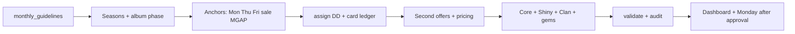

# Prize priority, building the month & how to use the MD library

**Audience:** Monetization planners, Cursor agents, economists.  
**Canonical workspace:** `/Volumes/studios/Slotomania/CRM3/MM Calendar/Cursor Work`
**Last updated:** July 2026

---

## Part 1 — Prize priority (what to put where)

### 1.1 Authority order (when rules conflict)

| Priority | Source | Use for |
|----------|--------|---------|
| 1 | Live explicit instruction from Itay | Overrides all project documents |
| 2 | `00_GUIDELINES_ITAY.md` | Standing planning, evidence, and precedence rules |
| 3 | `monthly_guidelines/YYYY-MM.md` | HARD month-specific ceilings and card **bank per week** |
| 4 | `constraints.md` + `rules_cheatsheet.md` | HARD/SOFT scheduling, mutual exclusions, rotation |
| 5 | `learnings.md` + `daily_mm_reports.md` | Operational wins/fails, cooldowns, observed context |
| 6 | `performance/` canonical variant docs + cited analyses | Which **variant** has relevant evidence |
| 7 | `patterns_derived.md` | Empirical Monday-board patterns (frequency, spacing) |

**Never invent card types** that are not in the current week’s bank in the monthly guideline table.
Low-confidence evidence is directional only and must not be presented as a confirmed learning.

---

### 1.2 Card prize value (premium slots first)

From economy (August 2026 guideline) — **higher = reserve for premium purchase slots** (Decoy d3, Counter PO, BTS, flagship days):

```
Wild Gold / Wild Ord / Shiny Limited  >  Shiny Card  >  high stars (5★ > 4★ > 3★)
```

| Card type | Rules |
|-----------|--------|
| **Shiny Limited** | ~1/week channel; purchase promos only; not a fixed gameplay drip |
| **Wild** | ≤1 Wild **per offer source**; album **last week** → purchase prizes **Wild only** (no Reg/Ace/Gold in offers) |
| **Gold** | **Purchase offers only** (DD on-purchase, RYD, Buy All, Decoy, PM, Counter PO) — **not** Core/PYP/MES prizes |
| **Ace** | Gameplay / challenges only — **not sold** in purchase offers |
| **Reg** | Default for challenges, ADS, mid-tier slots |
| **1★ / 2★** | Allowed **on top** of a main card prize |

**Weekly bank:** Every card in DD / Offers / Core / ADS / Shiny Show must come from that week’s row in `monthly_guidelines/YYYY-MM.md` (counts = **ceiling**, not mandatory fill).

---

### 1.3 SKU & booster priority (by context)

| Context | Prefer | Avoid |
|---------|--------|--------|
| **Short Term alive** | Blast → Superboom/PAB · Battlesheep → Parasheep/Airstrike · SNL → Dice (×2/×3, not ×1) / Multiwheel / Shield | Wrong-season SKU; AS on Blast days |
| **Mid Term alive** | Figz/Globez → **3000 Hero Coins** · Quest → **Quest Booster** | Wrong mid-term token |
| **Extreme Stamp day** | Replace RDS with Extreme Stamp; **4 RDS → 2 Extreme** in offers | Wild in same offers as Extreme Stamp |
| **Hammers (HARD)** | **One product per day** only; Rolling may spread hammers across its own cycles | Second product with hammers same day → use Picks/PAB/card instead |
| **Hammers vs pricing** | Medium 3–6 · High ≤8 · Max ≤12 | >4 hammer **days** per week |
| **ADS PO** | Coins, Gems, low Reg, season-appropriate low card | Gold, Shiny Limited, high Ace, Wild |
| **Core challenge prize** | Reg / Ace / Shiny / Wild | Gold, any SB form |
| **RYD** | Always **more than % SB** (card, hammers, booster) | 155% SB (legacy Cinco rule) |
| **Rolling stamps** | Per cycle: **≤4 RDS** (1+3 steps), **≤2 GGS** (1+1) | Extra RDS/GGS on BXGY free pool beyond stamp slots |

---

### 1.4 Promo / lane priority (revenue · PU · gems)

Use for **which lane to protect or add**, not as an excuse to break HARD caps.

| Goal | Protect / favor | Strong variants | Weak / scarce |
|------|-----------------|-----------------|---------------|
| **Revenue depth** | MGAP, Daily Deal, Payment Page, Gems, Rolling | MGAP Bigger / BOGO · Rolling **Buy More for Less** · DD Hammers | Rolling Supersized |
| **Paying users (breadth)** | **Daily Deal #1**, MGAP, Clan-Dash, Gems, Rolling | DD + Dash template on Mondays | Huge Monday VFM stacks |
| **Gem burn** | Shiny Show | Joker · All Cards · Wild Guaranteed | Crazy with Aces |
| **Wide lift (amplifiers)** | Boosted Gemback, GGS, Extreme Stamp, Jumbo, HH | Schedule in **sales windows**; Gemback halo on gem spend | Treating amplifiers as direct revenue SKUs |

**Lift comparisons:** use same-weekday **trailing ≥20 complete days** (`measurement/MEASUREMENT_METHODOLOGY.md`), not single-day %Difference from dashboards.

**Offers rotation (HARD):** {Buy All, Bonanza, Rolling, RYD} — spread types; do not repeat the same second-offer family on consecutive days.

---

### 1.5 Where to spend a scarce prize (decision cheat)

```
Premium day (sale / BTS / Counter PO / Decoy d3)?
  → Wild / Shiny Limited / 5★ / top bank card

Normal purchase second offer?
  → Reg/Ace/Gold per bank + season SKU on hook

Core / coin sink?
  → Reg or Ace challenge prize; stronger prizes on sale day + day after

ADS?
  → Lowest tier that still matches season + weekly bank

Monday (Dash Day)?
  → DD + one light second offer (RYD or Buy All); Rolling only on MFL anchor days
  → No MGAP / Coin Sale / big Prize Mania on Monday
```

---

## Part 2 — Rules for building the month

### 2.1 Pipeline (human + agent)



**August 2026 (code):** `scripts/build_august_2026_plan.py` encodes much of this → `mm_calendar/data/august_2026_plan.json`.

After any builder change:

```bash
python3 scripts/build_august_2026_plan.py
python3 scripts/audit_august_2026_plan.py
```

---

### 2.2 Month-level checklist

1. Read **`monthly_guidelines/YYYY-MM.md`** end-to-end (cards table, MGAP, gems, hammers, album phases).
2. Map **Short / Mid / Album** windows (`README.md`, `lanes.md`, `recurring_events.md`).
3. Place **fixed anchors**: Machine Launch ×2, Price Cut ×2, Counter PO ×2, **MGAP BOGO ×1** (not last day, not sale day; prefer day after sale).
4. Plan **MGAP 2/week** (August iron rule — not 3).
5. Plan **Rolling MFL** with ≥10d cooldown; BMFL = 3 cycles, High only.
6. Plan **sales** Fri–Sat only; Black Diamond 1/week; Lotto peaks on Night Plan.
7. Run **card ledger** logic: Wild/Shiny Limited once-pair DD needs companion multiple DD same day.
8. Validate: VFM ≤1/day (22 BTS exception), **≥1 VFM second offer every day** (Dash does not count), DD pricing ≠ second offer, weekly M/H/Max spread, season SKUs, no MGAP+Coin Sale cannibalization.

---

### 2.3 Day-level build order (HARD preference)

From `rules_cheatsheet.md` — when conflicts arise, **cut from bottom up**:

| Step | Layer | Examples |
|------|--------|----------|
| 1 | **Purchase offers** | Daily Deal + second offer (RYD / Decoy / Rolling / Buy All / Coin Sale row) |
| 2 | **Revenue amplifiers** | MGAP, Extreme Stamp, Gemback, HH, Price Cut |
| 3 | **Gameplay / coin sink** | PYP, Win Master, MES, Spin Zone, Custom Pod |
| 4 | **Everything else** | Piggy, Lotto, LBP, features |
| 5 | **ADS** | Always **last**; **separate Monday Product** (not Daily Deal); low prizes only |

**ADS vs Daily Deal:** Plan ADS only after steps 1–4 for that day. ADS does not share DD’s pricing-separation rule or premium-prize checklist.

**Density:** normal day ~6–9 board rows; big event 15–25.

**Timing:** Promo Time **11:00 UTC**; Night Plan **00:00 UTC**; time-limited features after 12:00; Gemback **5h**; x2 GGS **3h**.

---

### 2.4 Monday board vs planner

- **Planner JSON** = full day design.
- **Monday `build_rows()`** = subset of products (DD, RYD, Rolling, Buy All, Decoy, MGAP, Gems, …). Clan-Dash rows are **not** “the second offer” for VFM rules.
- Sync only when approved: `scripts/upload_mm_calendar_day_monday.py`.

---

## Part 3 — How to use every MD file

### 3.1 Start here (first hour)

| File | Purpose |
|------|---------|
| **`BUILD_CALENDAR_ROUTER.md`** | ⭐ Task → which topic folder / file to open |
| **`topics/README.md`** | Eleven domain entry points (examples + what to schedule) |
| **`PRIZE_PRIORITY_AND_MONTH_BUILD.md`** | This guide |
| **`rules_cheatsheet.md`** | All HARD/SOFT rules on one page |
| **`monthly_guidelines/YYYY-MM.md`** | Economy caps + **card bank** for the month |
| **`ONBOARDING_QUICK.md`** | 5-minute Cursor checklist |
| **`README.md`** | Package map and data sources |

---

### 3.2 Building & validating the calendar

| File | When to read |
|------|----------------|
| `constraints.md` | Full scheduling law; exclusions; frequency targets |
| `lanes.md` | Definition of each lane (DD, Rolling, RYD, MGAP, …) |
| `offer_construction.md` | How to fill slots (Buy All / Decoy / DD / RYD / Rolling) |
| `rolling_offer.md` | ⭐ Rolling BXGY 5/6-cycle anatomy (canonical Monday structure) |
| `day_planning_template.md` | Per-day anatomy and checklist |
| `recurring_events.md` | Weekly/monthly anchors (Dash, Piggy, Lotto, MGAP) |
| `album_cards.md` | Card taxonomy, Wild rules, Shiny Limited, bank |
| `nivi_collector_album_prizes.md` | Nivi phase prize tables (Spinner ranks, Short/Mid-term, Dash, Collectibles) |
| `board_schema.md` | Monday columns, products, upload contract |
| `approval_process.md` | Approval timeline (month before) |
| `examples/YYYY-MM_calendar.md` | Human-readable output for the month |
| `examples/august_2026_audit.md` | Example audit notes |

**Code / rules:** `.cursor/rules/mm_calendar_builder.mdc` (builder algorithm).

---

### 3.3 Cards, seasons, art

| File | When to read |
|------|----------------|
| `monthly_guidelines/YYYY-MM.md` | **Card distribution table** (authoritative) |
| `album_cards.md` | Card types, album phases, where cards may appear |
| `art_inventory.md` | CRM3 Shiny Show art (reuse vs new theme) |
| `core_mes_references.md` | Core/MES challenge prize patterns |

---

### 3.4 Performance & what to favor

| File | When to read |
|------|----------------|
| `top_promos.md` | Top 10 promos + amplifiers |
| `promo_revenue_analysis.md` | Best **variant** per promo family |
| `performance_benchmarks.md` | Lane-level revenue ranking |
| `shiny_show_performance.md` | Shiny Show variants vs gem usage |
| `boosted_gemback_impact.md` | Gemback halo evidence |
| `smart_calendar_insights.md` | Cross-cutting calendar insights |
| `smart_calendar.md` | Smart calendar product notes |
| `prediction/PREDICTION_AND_OPTIMIZATION.md` | Post-backtest forecast / recommendation methodology |
| `relationships_deep.md` | Promo combinations and interactions |
| `patterns_derived.md` | Mined Monday-board patterns |

---

### 3.5 Operations & learnings

| File | When to read |
|------|----------------|
| `learnings.md` | Best practices, cooldowns, monthly goals |
| `daily_mm_reports.md` | Day-level postmortems and hooks |
| `deep_study_may_june.md` | Rituals, density, ADS sequences |
| `dice_promos.md` | Dice Booster vs Deluxe vs SNL |
| `lotto_bonus.md` | LBP peaks and rotation |
| `dpu_calendar.md` | DPU segment calendar (separate from main MM) |

---

### 3.6 Data, DWH, research (optional)

| File | When to read |
|------|----------------|
| `dwh_reference.md` | Tables for calendar research |
| `core_wager_analysis.md` | Wager / core economy analysis |
| `deep_research_insights.md` | Longer research memos |

---

### 3.7 Repo root (outside `mm_calendar/`)

| File | Purpose |
|------|---------|
| **`AGENTS.md`** | Cursor commands, August product rules, MCP |
| **`TEAM_WORKLOG.md`** | **Required** agent handoff log |
| **`BACKUP_LOCAL.md`** | Local vs studio vs OneDrive sync (Itay backup) |

---

## Part 4 — Suggested reading paths

**New teammate — build August:**

1. `ONBOARDING_QUICK.md` → `PRIZE_PRIORITY_AND_MONTH_BUILD.md` (this file)  
2. `monthly_guidelines/2026-08.md` + `rules_cheatsheet.md`  
3. `offer_construction.md` + `album_cards.md`  
4. Open `data/august_2026_plan.json` + `examples/2026-08_calendar.md`  
5. Run build + audit scripts  

**“Which prize for Thursday Decoy?”**

1. Week row in `monthly_guidelines/2026-08.md`  
2. `PRIZE_PRIORITY_AND_MONTH_BUILD.md` §1.2–1.5  
3. `offer_construction.md` (Decoy d1/d2/d3)  
4. Short Term line in `lanes.md` for season SKU  

**“Why did validation fail?”**

1. Build script stdout / `validate_august_plan` rows in `examples/2026-08_calendar.md`  
2. `constraints.md` + `rules_cheatsheet.md` for the named rule  
3. `scripts/audit_august_2026_plan.py` for daily/weekly/monthly breakdown  

---

## Part 5 — Agents: after you change anything

Append to **`TEAM_WORKLOG.md`** (repo root): date, goal, files, commands (build ✓/✗, audit ✓/✗), notes for next agent.

Do not sync Monday `--all` unless the user explicitly approves.
