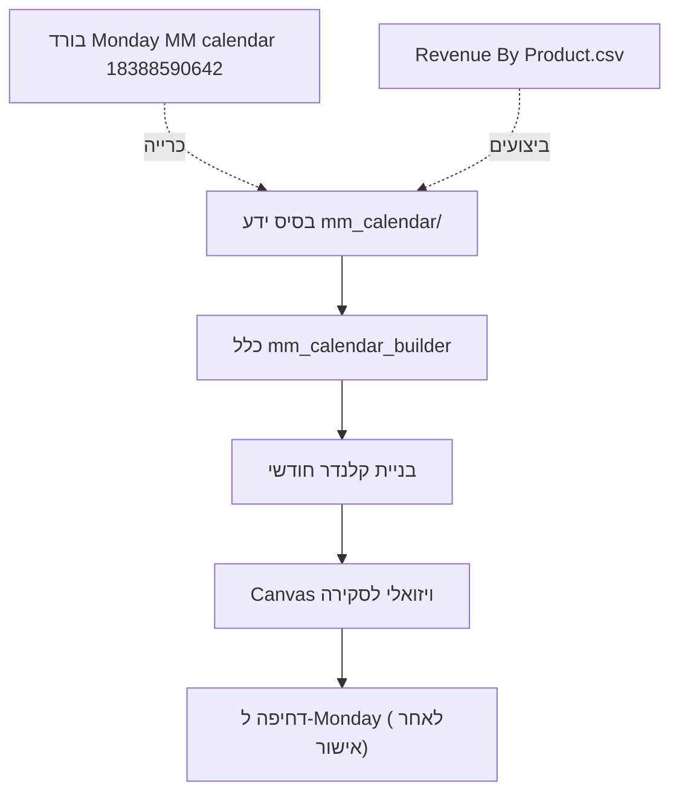

# MM Calendar - בסיס ידע לבניית קלנדר מוניטיזציה

בסיס ידע שמאפשר לאייג'נט להכיר את כל הגיידליינים של מוניטיזציית Slotomania ולבנות **קלנדר פרומואים חודשי** ("סודוקו" של שיבוץ מסלולים מרובים עם תלות הדדית).

## ⭐ נקודת כניסה לסוכנים

| קובץ | מתי |
|------|-----|
| **`00_GUIDELINES_ITAY.md`** | **תמיד ראשון** — סמכות, כללי ברזל, ואיסור inference |
| **`BUILD_CALENDAR_ROUTER.md`** | משימה → תיקייה/קובץ |
| **`topics/README.md`** | מפת 11 תחומים (DD, Rolling, MGAP, …) — דוגמאות + מה לשבץ |
| `measurement/README.md` | מקורות, identity, schema, baseline, conflicts, refresh |
| `performance/README.md` | instances + תוצאות קנוניות לפי KPI/variant |
| `prediction/PREDICTION_AND_OPTIMIZATION.md` | חיזוי והמלצה אחרי backtest |
| `PRIZE_PRIORITY_AND_MONTH_BUILD.md` | עדיפות פרסים + pipeline חודש |
| `ONBOARDING_QUICK.md` | 5 דקות |

## מבנה החבילה

| קובץ | תוכן |
|---|---|
| `rules_cheatsheet.md` | ⭐ **סיכום מהיר** של כל הכללים (HARD/SOFT) במקום אחד - להתחיל כאן |
| `monthly_guidelines/YYYY-MM.md` | ⭐ תקרות חודשיות ובנק קלפים מהכלכלה (Nivi); HARD מתחת להוראה חיה ול-`00_GUIDELINES_ITAY.md` |
| `lanes.md` | **ליבה** - כל מסלול: הגדרה, מכניקות, SKUs, always-on מול רוטציוני, תפקיד מוניטיזציה |
| `day_planning_template.md` | אנטומיית יום + צפיפות (5-9/יום) וגיוון: ADS PO יומי, Shiny Show מגוון, Clan-Dash, הצעות קומבו |
| `deep_study_may_june.md` | מחקר עומק של 2 חודשים: ריטואלים (אירוע/אלבום/מכונה), רצף ADS, תחכום DD, צפיפות לא-אחידה |
| `top_promos.md` | 10 הפרומואים החוזרים ביותר, מגבירים רוחביים, כלל ניקוז קוינז יומי |
| `dpu_calendar.md` | קלנדר-סגמנט DPU (winback של משלמים שנשרו): עקרונות, תוצאות, דוגמת יולי |
| `recurring_events.md` | עוגנים שבועיים/חודשיים קבועים (Dash Day, פיקי Lotto, MGAP שבועי, Price Cut, Machine Launch) |
| `learnings.md` | למידות תפעוליות + מטרות חודשיות (best practices) |
| `approval_process.md` | תהליך האישורים (6 תחנות בחודש הקודם, ללא שישי/שבת) - טאב נפרד בקנבס |
| `art_inventory.md` | אינוונטר ארטים מוכנים ב-CRM3 (Shiny Show): themed מול generic (`scripts/scan_shiny_art.py`) |
| `core_mes_references.md` | Core/MES = צ'אלנג' עם פרס בסוף; רפרנסים מוכנים ב-CRM3/Features/MES |
| `dice_promos.md` | טקסונומיית Dice: Dice Booster (בוסטר) · Dice Deluxe (מוצר רווחי) · SNL Dice (עונתי) |
| `lotto_bonus.md` | פרומואי Lotto Bonus (LBP) + רוטציה; עולה בפיקי Night Plan |
| `offer_construction.md` | ⭐ איך ממלאים תוכן (SKUs) לכל סוג הצעה - Buy All/Decoy/DD/RYD/Rolling (כמו Description במאנדיי) |
| `rolling_offer.md` | ⭐ **מקור אמת** — מבנה BXGY 5/6 cycles (6 denoms ל-cycle), Supersized, BMFL vs BXGY; פריסת Description |
| `PRIZE_PRIORITY_AND_MONTH_BUILD.md` | ⭐ **עדיפות פרסים**, בניית חודש, ומפת כל קבצי ה-MD |
| `constraints.md` | חוקי השיבוץ (HARD/SOFT): always-on, רוטציה, frequency targets, Pricing, אירועים, הדרות |
| `album_cards.md` | טקסונומיית קלפי האלבום (Regular/Ace/Gold/Wild/Shiny) ודירוג ערך |
| `nivi_collector_album_prizes.md` | ⭐ פרסי פיצ'רים לפי שלב אלבום (Nivi) — Spinner, Short/Mid, Dash, Collectibles |
| `performance_benchmarks.md` | דירוג הכנסה לפי פיצ'ר (מ-CSV) + מיפוי SKU↔מסלול |
| `shiny_show_performance.md` | דירוג וריאציות Shiny Show לפי צריכת ג'מס (Joker/All Cards מנצחים; Crazy with Aces חלש) |
| `promo_revenue_analysis.md` | דירוג הכנסה **ברמת פרומו** - איזו וריאציה הכי חזקה בכל מסלול (הצלבת CSV x בורד) |
| `patterns_derived.md` | דפוסים אמפיריים שנכרו מבורד Monday (תדירות, משכים, רצפים) |
| `board_schema.md` | חוזה בורד Monday: id, עמודות, תוויות, קריאה/כתיבה |

הכלל המבצע: `.cursor/rules/mm_calendar_builder.mdc` - מקודד את אלגוריתם הבנייה והוולידציה.

## איך זה עובד

## מקורות הדאטה

- **מפת מקורות והיררכיה:** `measurement/SOURCE_INVENTORY.md`.
- **בורד תכנון/קופי:** `MM calendar` (id `18388590642`), דרך `scripts/monday_client.py`. Sandbox לבדיקות: `18413621867`.
- **אמת תפעולית של מה חי:** `dwh.sm_fact_smart_calendar_promotion_updates` לפי `smart_calendar.md`.
- **תוצאות יומיות:** `agg.agg_sm_daily_users_stats` / `data/wide_revenue_pu.json`.
- **ביצועי הכנסה**: `Revenue By Product.csv` (מאי-יוני 2026, ~$37.3M).
- **ראיון** עם מנהל המוניטיזציה (Short/Mid Term, Album, מבנה המסלולים).

## ארכיטקטורת הקלנדרים

- **קלנדר ראשי (MM)** - כל הסגמנטים, כל המסלולים (לב בסיס הידע).
- **קלנדרי-סגמנט** - קלנדרים ייעודיים לסגמנט שחקנים ספציפי, כל אחד עם יעד משלו:
  - **DPU** (`dpu_calendar.md`) - winback של משלמים שנשרו.
  - NPU / Dormant - (פוטנציאל; אותו עיקרון).

## 13 המסלולים (+ Products נוספים בבורד)

Short Term, Mid Term, Album, Daily Deal, Offers & coin sale, Core, Gems, SlotoBucks, Clan-Dash, ADS, MGAP, Extreme Stamp + Rolling offer, RYD, Buy all, Event, Prize Mania, Counter PO, Black Diamond, DTC.

## סטטוס ופתוחים

בסיס הידע נכתב מכרייה אמפירית + ראיון. **נסגר:** Sticky Bundle PP = Daily Deal; Payment Page = החנות (לא מסלול); Segmented = תכונת טירגוט (DPU/NPU/Dormant/Black Diamond/Finishers); Black Diamond = VIP; Counter PO = הצעה פרסונלית קופצת; **Stash Booster** (שורות RLAP בבורד) = `stash_booster.md`; DTC = לא רלוונטי.

**נסגר בנוסף:** caps קשיחים = הגיידליינים החודשיים מהכלכלה (`monthly_guidelines/`); רשימת הדרות הדדיות (MGAP Matched/Limited PO/Extreme Stamp/DD BOGO); מגבירים רוחביים; כלל ניקוז קוינז יומי; 3 Shiny Shows/שבוע; קבוצת רוטציית Offers.

**דוגמה מלאה**: קלנדר יולי 2026 בנוי ומאומת - קנבס `july-2026-calendar.canvas.tsx` + `examples/2026-07_calendar.md`.

**פתוחים שנותרו** (קלט חיצוני):
- תאריכי Machine Launch (×2/חודש) - ממחלקת הסלוטים.
- לוח חגים/אירועים שנתי - קלט פר-חודש.

**עודכן:** יולי 2026.
