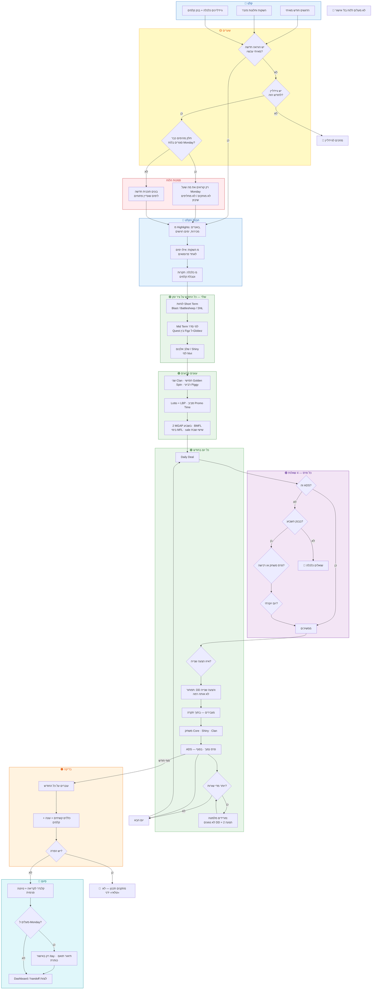
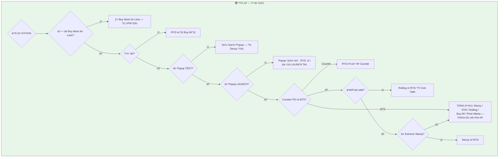

# עץ החלטות (צבעים) — איך בונים חודש ב-MM Calendar

**למי:** Itay, צוות מוניטיזציה, כלכלה, מנהלים  
**במילים:** מדריך **אחד** שמסביר **באיזה סדר** ממלאים חודש — מהרגע שמגיעים **הדגשים שלך**, **תאריכי השקה של פיצ'רים**, ו**גבולות מהכלכלה** — ועד לוח מוכן לביצוע.

**עודכן:** יולי 2026  
**גרסה מפורטת בטקסט (ללא צבעים):** [MONTH_BUILD_DECISION_TREE_HE.md](./MONTH_BUILD_DECISION_TREE_HE.md)

---

## מילון קצר — מונחים שחוזרים בכל העץ

| מונח | מה זה בפועל |
|------|-------------|
| **Daily Deal (DD)** | ההצעה היומית המרכזית — «מה קונים היום» בחנות |
| **הצעה שנייה / VFM** | עוד הצעת רכישה «שווה» באותו יום (למשל RYD, Buy All, Decoy, Rolling, Prize Mania). **פעילויות Clan-Dash לא נספרות** כהצעה שנייה |
| **Short Term** | לוח קצר (Blast / Battlesheep / SNL) — קובע **איזה בустר/פרס עונתי** מתאים (Superboom, Parasheep, קוביות Dice וכו') |
| **Mid Term** | עונות בינוניות (Quest, Globez, Figz, Winovate, Mega Pods) |
| **בנק קלפים** | טבלה שבועית מהכלכלה — **רק** קלפים שמופיעים שם מותרים באותו שבוע |
| **עוגן** | משהו שחוזר בקביעות (יום שני Dash, Lotto בלילה, מכירת סוף שבוע וכו') |
| **מגביר** | פרומו שמגביר רכישות/ג'מים (MGAP, Gemback, x2 GGS, Extreme Stamp) — לא «עוד הצעה» לבד |
| **Promo Time** | 11:00 UTC — נקודת זמן שמסביבה מתכננים Lotto/LBP וחלונות קצרים |
| **Monday (הלוח)** | לוח התכנון שרואים ב-Monday.com — שם יושבות השורות לכל יום |

---

## מקרא צבעים בעץ

| צבע | משמעות | מתי רואים את זה |
|-----|--------|------------------|
| 🔵 **כחול** | **מה נכנס לתכנון** | לפני שמוסיפים שורה ליום |
| 🟡 **צהוב** | **שאלה שחייבת תשובה** | אין המשך בלי החלטה |
| 🟣 **סגול** | **כלל כלכלה קשיח** | אם עוברים — שואלים כלכלה |
| 🟢 **ירוק** | **ממלאים את הלוח** | שלד, עוגנים, יום-יום |
| 🟠 **כתום** | **בדיקה לפני סגירה** | האם הכל עקבי וחוקי |
| 🔴 **אדום** | **עצור** | חסר מידע, הפרה, או פעולה בלי אישור |
| 🩵 **טורקיז** | **מסירים לצוות** | תוכנית סגורה / העלאה ללוח |

---

## שלב 0 — מה צריך לקבל לפני שמתחילים

שלושה סוגי קלט. **בלי שלושתם (או תחליף מפורש ממך) — לא בונים חודש שלם.**

### 🔵 א. Highlights חודש (ממך)

זה «סיפור החודש» — לא רשימת פרומואים, אלא **מה חשוב**:

- אירועים ושיווק (יום הולדת מכונה, סוף שבוע נוסטלגי, Back to School, וכו')
- אילו סופי שבוע **מכירה** (coin sale)
- מה **לא** לגעת (ימים שכבר סגורים בראש, עוגני MFL, Popup TEST/LAUNCH)
- דגשים מיוחדים: «שבוע קל בשני», «שבוע Heavy ב-Lotto», «לא Decoy ביום X»

**מה עושים עם זה:** מסמנים **באנר/עוגן** לימים רלוונטיים, ומוודאים שהצעות **heavy** לא נערמות באותו יום.

### 🔵 ב. השקות וחלונות פיצ'ר (מוצר / LiveOps)

- **מתי** נפתח Popup Store, Puzzle, מכונה חדשה, RLAP/Stash Booster
- **כמה ימים** נמשך Short Term / אירוע Core
- **האם** יש cohort (TEST מול LAUNCH) — ואז **מי** רואה מה

**מה עושים עם זה:** שמים **שורות נפרדות** בימים הנכונים, ו**לא** מכפילים אותו דבר פעמיים (למשל Decoy נפרד ביום שכבר יש Popup עם Decoy בפנים).

### 🔵 ג. גיידליינים מהכלכלה (חודש + שבוע)

- תקרות: כמה פעמים MGAP, Gemback, x2 GGS, Hammers, Gems Sale
- **אורך עונות:** למשל SNL **3–4 ימים**, Blast/Battlesheep בערך **5 ימים**
- **טבלת קלפים לכל שבוע** — זה «תפריט» מותר ל-DD, הצעות, Core (בהתאם לסוג פרס)

**מה עושים עם זה:** כל פרס עובר דרך «האם מותר השבוע?» לפני שמכניסים ליום.

---

## העץ הראשי — מההתחלה עד סגירת חודש

*(התרשים למטה — אותו סדר כמו הטקסט. פתחו Preview ב-GitHub/Cursor כדי לראות צבעים.)*

---

## 🟡 שער 1 — הוראה חיה מאיתי

**שאלה:** האם **בשיחה הנוכחית** נתת הוראה ספציפית (תאריך, פרומו, ביטול)?

| תשובה | מה קורה |
|--------|---------|
| **כן** | ההוראה **גוברת** על כל מסמך ועל מה שהיה בטיוטה. מיישמים אותה, ואז ממשיכים לשאר החודש רק במקומות שלא נגעת |
| **לא** | ממשיכים לשער 2 |

**דוגמאות להוראה חיה:** «Popup רק 12/19/26», «ב-26 RYD רק BACKUP», «SNL ארבעה ימים», «אל תיגע ב-1–15 באוגוסט על Monday».

---

## 🟡 שער 2 — יש גיידליין כלכלה לחודש?

**שאלה:** האם קיבלנו מ-Nivi/כלכלה **גיידליין חודשי** (תקרות + **טבלת קלפים לכל שבוע**)?

| תשובה | מה קורה |
|--------|---------|
| **לא** | 🔴 **עוצרים.** לא ממציאים תקרות ולא בוחרים קלפים «לפי רגש». מבקשים גיידליין |
| **כן** | מדביקים את הטבלה לשבועות וממשיכים |

---

## 🟡 שער 3 — מה כבר «סגור» על Monday?

**שאלה:** האם **חלק מהימים** כבר **מסוכמים ויושבים על Monday** (למשל אוגוסט 1–15)?

| תשובה | מה קורה |
|--------|---------|
| **כן, טווח סגור** | **Monday = האמת** לטווח הזה. לא מוחקים שורות, לא מריצים «סנכרון מלא» שמחליף ידנית. שינוי רק **באישור Itay**, שורה-שורה |
| **לא / רק טיוטה** | בונים תוכנית חדשה לכל החודש (או לחלק הפתוח) |

**כלל חשוב על הלוח:** **מה שכתוב בשם השורה (כותרת) — נכון.** אם התיאור (Description) לא תואם — **מתקנים את התיאור**, לא «מתקנים» את הכותרת מהטיוטה.

---

## 🔵 אחרי השערים — איך מפרקים את הקלט

### מה עושים עם Highlights

1. מסמנים **ימי SALE** (בדרך כלל שישי+שבת) — שם יושבות Coin Sale והצעות חזקות יותר  
2. מסמנים **ימי אירוע** — באנר, theme, מכונות, לוט/קampain  
3. מסמנים **ימים רגישים** — שני (Dash), MFL, Popup, BTS — שם **לא** עורמים עוד VFM כבד  
4. רושמים **purchase driver** (למשל 1 לחודש — denom גדול בחנות) — זה **לא** מחליף הצעה שנייה

### מה עושים עם השקות

1. **יום פתיחה** ו**יום סגירה** על הלוח  
2. אם יש **TEST ואז LAUNCH** — רושמים מי רואה מה; ביום LAUNCH **לא** מריצים במקביל שתי הצעות שמתחרות על אותו שחקן  
3. אם פיצ'ר **מחליף** משהו (למשל Stash במקום MGAP ביום מסוים) — **לא** שמים גם את הישן

### מה עושים עם גיידליין כלכלה

1. **תקרות שבועיות/חודשיות** — MGAP (למשל בדיוק 2 בשבוע), x2 GGS, Gemback, Hammers  
2. **אורך עונות** — במיוחד SNL קצר (3–4 ימים) מול Blast/Battlesheep ארוכים יותר  
3. **בנק קלפים** — מעתיקים לכל שבוע; כל DD / Decoy / RYD / Core (לפי סוג) חייב להיות **מתוך הטבלה**

---

## 🟢 שלב 1 — שלד החודש (לפני מילוי יום-יום)

**רעיון:** קודם **ציר זמן**, אחר כך פרסים. כמו לשים קירות לפני רהיטים.

### 1.1 Short Term (לוח קצר)

| לוח | בערך כמה זמן | מה זה משפיע עליו |
|-----|--------------|-------------------|
| **Blast** | ~5 ימים | Superboom, PAB, פרסי Blast |
| **Battlesheep** | ~5 ימים | Parasheep, Airstrike |
| **SNL** | **3–4 ימים** (כלל קשיח) | קוביות (Dice), Multiwheel, Shield — **לא** למתוח ל-5 ימים |

**החלטה:** אחרי SNL — **מיד** עוברים ל-Blast/Battlesheep הבא, בלי «חור» ארוך.

### 1.2 Mid Term (עונות בינוניות)

**סדר מחזור (חובה):** Figz → **Quest** → Globez → **Quest** → …  
**Quest תמיד בין Figz ל-Globez.**

מוסיפים בנפרד (לפי Nivi): **Winovate**, **Mega Pods** — לא דורסים Mid Term אחד את השני באותו slot.

### 1.3 אלבום / Shiny

- באיזה **שלב Shiny** (MS1, MS2…) אנחנו  
- **מתי** נפתח/נסגר Shiny Collection — משפיע על Shiny Show ועל DD Shiny

---

## 🟢 שלב 2 — עוגנים (לפני Daily Deal)

אלה דברים ש**כמעט לא זזים** — שמים אותם על הלוח ואז ממלאים סביבם.

| מתי | מה בדרך כלל |
|-----|-------------|
| **שני** | Clan Dash Day — bundle, Go Premium, Max Deal. **VFM קל** (לא ערימת revenue) |
| **שלישי/שישי** | x2 Dash Points (לפי template) |
| **רביעי** | Piggy, לפעמים X2 Badges |
| **חמישי** | Golden Spin, Clan Go badges |
| **לילה (Night Plan)** | Lotto peak + **שורת LBP** מזווגת — חלון מ-00:00 עד Promo Time (11:00 UTC) |
| **כל שבוע** | **2 MGAP** — לא שלישי, לא בשני «כבד», לא יחד עם sale בצורה אסורה |
| **ימי MFL** | **Buy More for Less** בלבד — 3 מחזורים, תמחור High — **בלי** הצעה שנייה נוספת |
| **שישי–שבת sale** | Coin Sale + לרוב Rolling או RYD **ליד** — לא עוד Decoy כבד באותו יום |

---

## 🟢 שלב 3 — מילוי **יום אחד** (חוזרים על זה לכל יום)

### מה **חייב** להיות ביום «רגיל»

| # | חובה? | מה |
|---|--------|-----|
| 1 | **כן** | Daily Deal |
| 2 | **כן** | **לפחות הצעה שנייה אחת** (או Popup / MFL שממלאים את התפקיד) |
| 3 | **כן** | משהו שמושך **הימור מטבעות** (Core / MES / Spin Zone…) — **בשני:** לפעמים מספיק Dash Pass |
| 4 | **כן** | **ADS** — פרס **נמוך**, **אחרון** ברשימה |
| 5 | לפי שבוע | MGAP אם נשאר «מכסה» (מקס 2 בשבוע) |
| 6 | לפי template | Clan (לא נספר כ-VFM) |

### 🟣 לפני כל פרס — ארבע שאלות

| # | שאלה | אם כן | אם לא |
|---|------|-------|-------|
| **1** | זה **ADS**? | רק מטבעות / ג'מים / reg נמוך — **בלי** Wild, Gold, Shiny חזק | ממשיכים ל-2 |
| **2** | הקלף **בבנק השבוע**? | ממשיכים | 🔴 **עוצרים** — שואלים כלכלה |
| **3** | **משחק** (Core/MES) או **רכישה** (DD/RYD/Decoy…)? | משחק: **אין Gold**. רכישה: Gold מותר; Wild **לכל היותר אחד** למקור הצעה | — |
| **4** | **יום יוקרה** (sale, Decoy d3, Counter PO, אירוע)? | שומרים Wild / Shiny Limited / 5★ לslots היוקרתיים | reg/ace/gold לפי בנק + **בустר של העונה החיה** |

**SKU לפי Short Term חי:**  
Blast → Superboom/PAB · Battlesheep → Parasheep/Airstrike · SNL → קוביות (×2/×3), Multiwheel, Shield  

**יום Extreme Stamp:** בחותמות — Extreme במקום RDS; **לא Wild** באותן הצעות.  
**Hammers:** רק **מוצר אחד ביום** נותן פטישים (Rolling יכול לפזר **בתוך** אותו Rolling).

### תמחור באותו יום

אם גם DD וגם ההצעה השנייה **עם** תמחור (High/Mid/Max) — **חייבים רמות שונות**.  
ברירת מחדל: High לימים חזקים; לא רצף ארוך של Max בלי סיבה.

### אם היום **צפוף מדי**

**מורידים מלמטה למעלה** (לא נוגעים ב-DD וב-VFM):

1. ADS מיותר / כפול  
2. Lotto / Piggy / תוספות  
3. Core שני  
4. מגבירים  

---

## 🟢 עץ משנה — **איזו הצעה שנייה** ביום?

**כלל:** עוברים **מלמעלה למטה**. **השורה הראשונה שמתאימה — מנצחת.**  
Clan-Dash **לא** נספר.

**הסברים קצרים:**

- **MFL בשני:** ה-Rolling של «Buy More for Less» **הוא** ההצעה השנייה — לא מוסיפים Decoy/RYD כבד באותו יום.  
- **Popup TEST (למשל 12/19):** Decoy/תוכן **בתוך** Popup — **לא** שורת Decoy Bonanza נפרדת באותו יום.  
- **Popup LAUNCH (למשל 26):** Popup = העיקר; שורת RYD «BACKUP» רק אם LAUNCH לא עלה — **לא** לרוץ במקביל.  
- **שאר הימים:** מסתובבים בין סוגי הצעות — **לא** Decoy אחרי Decoy, לא אותו משפחה יום-אחרי-יום.

---

## 🟣 תקרות כלכלה — «האם מותר היום?»

| נושא | כלל פשוט |
|------|-----------|
| **MGAP** | **2 בשבוע**, לא בשני, לא לצד sale בצורה אסורה, **לא** MGAP+Bucks |
| **x2 GGS** | עד ~2 בשבוע, **3 שעות**, אחרי Promo Time, לא יום-אחרי-יום, **לא** באותו יום Gems Sale |
| **Gemback** | חלון מוגבל (למשל 5 שעות), לא על DD |
| **Gems Sale** | מוגבל בחודש — 30% חנות / 20% offers |
| **Hammers** | מקור **אחד** ביום; כמות לפי תמחור (Mid/High/Max) |
| **Rolling חותמות** | לכל cycle: עד 4 RDS (1+3), עד 2 GGS (1+1) |
| **BMFL** | 3 cycles, High בלבד, cooldown ~10 ימים בין עוגנים |

---

## 🟠 בדיקה לפני «סגרנו חודש»

עוברים על **כל החודש** (לא רק יום אחד):

| בדיקה | מה מחפשים |
|--------|-----------|
| **כל יום** | DD + הצעה שנייה + Core (או חריג מוסבר) + ADS |
| **VFM** | Clan-Dash לא נספר; Popup/MFL לפי כללים |
| **קלפים** | כל פרס purchase/game מתוך בנק השבוע + Gold רק ברכישה |
| **עונה** | SKU תואם Short/Mid Term **באותו יום** |
| **תמחור** | DD והצעה שנייה לא באותה רמת High/Max אם שניהם priced |
| **צפיפות** | לא יותר מדי Core / Shiny / revenue stack באותו יום |
| **Monday** | כותרת ותיאור **תואמים**; תאריכים על השורה הנכונה |

אם משהו **שובר כלל קשיח** — 🔴 **לא** «מתקנים בראש»; חוזרים לשלב הירוק ומתקנים את **התכנון**.

---

## 🩵 סיום — מה מוסרים

1. **קלנדר לקריאה** — טבלה/מסמך שהצוות יכול לעבור יום-יום  
2. **רשימת החלטות פתוחות** — מה עדיין TBD (כלכלה, קreativ, שעות מדויקות)  
3. **Monday** — רק אם **Itay ביקש** במפורש: העלאה **יום-יום** עדיף על «למחוק הכל ולהחליף»  
4. **Handoff** — מה השתנה, מה לא לגעת, מה לבדוק ב-LiveOps

---

## דוגמה מספרית — שלושה ימים (רעיון, לא חובה לאוגוסט)

### יום A — שלישי «רגיל»

1. DD מבנק השבוע  
2. Decoy **או** RYD (לא מה שהיה אתמול)  
3. MGAP אם נשאר מקום בשבוע  
4. Core אחד  
5. Shiny אם מגיע תור (~3 בשבוע)  
6. Clan לפי יום  
7. ADS  

### יום B — שני + MFL

1. DD  
2. **רק** Buy More for Less — **בלי** VFM נוסף  
3. Dash / Clan  
4. ADS  
5. **לא** MGAP כבד / Coin Sale  

### יום C — Popup soft launch

1. DD  
2. **Popup** + תוכן רכישה **בתוך** Popup  
3. **ללא** Decoy נפרד באותו יום  
4. Rolling / Gemback לפי מה שסוכם — בלי לשבור תקרות  

---

## מתי **לא** ממשיכים (🔴)

- אין גיידליין חודש / בנק קלפים  
- פרס לא בבנק — ולא קיבלנו אישור כלכלה  
- רוצים **למחוק או להחליף** שיבוץ שכבר חי על Monday **בלי** אישור Itay  
- ממציאים מספרים, תאריכי Popup, או אורך SNL — **במקום** לשאול  

---

## סיכום במשפט אחד

**קודם קלט (הדגשים + השקות + כלכלה) → שלד ועוגנים → כל יום: DD, הצעה 2, מגבירים במידה, משחק, ADS → בדיקה → רק אז ללוח — והכותרת על Monday תמיד מנצחת את התיאור.**
