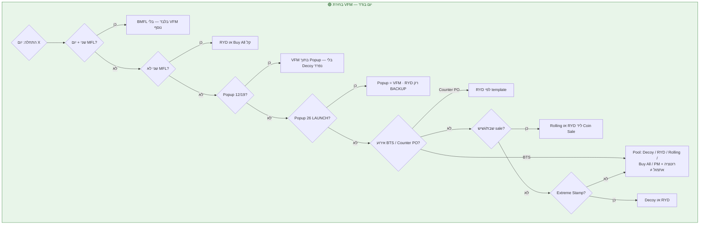

# עץ החלטות אחד (צבעים) — בניית חודש MM Calendar

**למי:** Itay, מוניטיזציה, כלכלה, סוכן Cursor  
**מטרה:** מפת **אחת** — מהרגע שמגיעים **highlights**, **השקות פיצ'רים** ו-**גיידליינים מהכלכלה** ועד JSON / Monday.  
**לא מחליף:** `monthly_guidelines/YYYY-MM.md`, `constraints.md` — מגדיר **סדר** ו**צמתי עצירה**.

**GitHub:** [קובץ זה](https://github.com/ppuregoldz-arch/slotomania-mm-calendar/blob/main/mm_calendar/documentation/MONTH_BUILD_DECISION_TREE_COLORED_HE.md)  
**פירוט טקסטואלי (נספח):** [MONTH_BUILD_DECISION_TREE_HE.md](./MONTH_BUILD_DECISION_TREE_HE.md)

**עודכן:** יולי 2026

---

## מקרא צבעים

| צבע | משמעות | דוגמה |
|-----|--------|--------|
| 🔵 **כחול** | **קלט** מאיתי / כלכלה / מוצר | Highlights, השקות, `monthly_guidelines` |
| 🟡 **צהוב** | **שאלה / שער** — חייבים תשובה לפני המשך | יש הוראה חיה? יש guidelines? |
| 🟣 **סגול** | **כלכלה HARD** — תקרות ובנק קלפים | MGAP×2, Hammers, Gems, SNL 3–4d |
| 🟢 **ירוק** | **בנייה** — שלד, עוגנים, מילוי יום | עונות, DD, VFM, Core |
| 🟠 **כתום** | **ולידציה / בדיקות** | `build_*` exit 0, `audit_*` |
| 🔴 **אדום** | **עצור / אסור** | אין guidelines, הפרת HARD, sync Monday בלי אישור |
| 🩵 **טורקיז** | **פלט / פרסום** | JSON, Markdown, Monday (מאושר) |

---

## העץ המלא (גרסה אחת)

העתק ל-Cursor / GitHub / Mermaid Live — הצבעים ב-`style` של subgraphs.

```mermaid
flowchart TB
  subgraph IN["🔵 קלט — לפני כתיבת שורה בלוח"]
    H["Highlights חודש מאיתי<br/>מטרות, אירועים, BTS, עוגנים מיוחדים"]
    F["השקות / חלונות פיצ'ר<br/>Popup, RLAP, מכונה חדשה, Night Plan, Album phase"]
    G["גיידליינים כלכלה<br/>monthly_guidelines/YYYY-MM.md<br/>תקרות + בנק קלפים שבועי"]
  end

  subgraph GATE["🟡 שערים — לא מדלגים"]
    Q1{"הוראה חיה מאיתי<br/>בשיחה הזו?"}
    Q2{"קיים monthly_guidelines<br/>לחודש?"}
    Q3{"טווח Committed על Monday?<br/>למשל אוג 1–15/2026"}
  end

  subgraph AUTH["🔴 / 🩵 סמכות לוח"]
    RO["Monday = read-only<br/>monday_board_live_by_date.json<br/>לא builder/sync שמוחק שיבוץ"]
    BL["בונים מתוכנית חדשה<br/>builder + JSON"]
  end

  subgraph PARSE["🔵 פירוק קלט → החלטות תכנון"]
    P1["ממפים Highlights →<br/>עוגני marketing + purchase drivers"]
    P2["ממפים השקות →<br/>ימים/שעות + שורות Core/Event/Offers"]
    P3["ממפים Guidelines →<br/>caps שבועיים/חודשיים + ledger קלפים"]
  end

  subgraph SKEL["🟢 שלד חודש — ציר זמן"]
    S1["Short Term blocks<br/>Blast/Battlesheep ~5d · SNL 3–4d"]
    S2["Mid Term rotation<br/>Figz→Quest→Globez→Quest<br/>+ Winovate + Mega Pods"]
    S3["Album phase + Shiny MS<br/>מ-nivi / boundaries"]
  end

  subgraph ANCH["🟢 עוגנים קבועים — לפני DD"]
    A1["שני Dash · חמישי Golden Spin · רביעי Piggy"]
    A2["Lotto peak + LBP · Promo Time 11:00 UTC"]
    A3["2 MGAP/שבוע · BMFL בימי MFL · sale שישי+שבת"]
  end

  subgraph LOOP["🟢 לולאה: לכל יום בחודש"]
    D1["DD — פרס מרכזי<br/>מבנק השבוע + SKU עונה"]
    D2{"VFM — הצעה שנייה<br/>ראה עץ משנה למטה"}
    D3["תמחור: DD + VFM priced<br/>→ רמות שונות"]
    D4["מגבירים — תוך caps<br/>MGAP · Extreme · Gemback · x2 GGS"]
    D5["Core coin sink ≤1 · Shiny ~3/שבוע<br/>Clan template · Winovate gem sink"]
    D6["ADS — פרס נמוך · אחרון"]
    D7{"יום צפוף?"}
    D8["חתוך מלמטה:<br/>ADS→Lotto/Piggy→Core2→מגבירים<br/>לא נוגעים DD+VFM"]
  end

  subgraph PRIZE["🟣 בכל פרס — 4 שאלות"]
    C1{"ADS?"}
    C2{"בבנק השבוע?"}
    C3{"משחק או רכישה?"}
    C4{"יום יוקרה?"}
    OKP["ממשיכים למילוי slots"]
    STOPC["🔴 עצור / שאל כלכלה"]
  end

  subgraph VAL["🟠 ולידציה"]
    V1["build_*_plan.py → exit 0"]
    V2["audit_* + season SKU + constraints"]
    V3{"HARD נכשל?"}
  end

  subgraph OUT["🩵 פלט"]
    O1["data/*_plan.json + examples/*_calendar.md"]
    O2{"Itay ביקש Monday?"}
    O3["upload יום-יום / sync<br/>Description ← כותרת Name"]
    O4["Dashboard / worklog"]
  end

  STOP1["🔴 עצור — בקש guidelines"]
  STOP2["🔴 עצור — תקן builder<br/>לא JSON ידני"]
  STOP3["🔴 לא Monday בלי אישור"]

  H --> Q1
  F --> Q1
  G --> Q1
  Q1 -->|כן| P1
  Q1 -->|לא| Q2
  Q2 -->|לא| STOP1
  Q2 -->|כן| Q3
  Q3 -->|כן| RO
  Q3 -->|לא| BL
  RO --> P1
  BL --> P1
  P1 --> P2 --> P3
  P3 --> S1 --> S2 --> S3 --> A1 --> A2 --> A3
  A3 --> D1
  D1 --> C1
  C1 -->|כן| OKP
  C1 -->|לא| C2
  C2 -->|לא| STOPC
  C2 -->|כן| C3 --> C4 --> OKP
  OKP --> D2 --> D3 --> D4 --> D5 --> D6 --> D7
  D7 -->|כן| D8 --> D7
  D7 -->|לא| LOOP
  D6 -->|יום הבא| D1
  D6 -->|סוף חודש| V1
  V1 --> V2 --> V3
  V3 -->|כן| STOP2
  V3 -->|לא| O1 --> O2
  O2 -->|כן| O3 --> O4
  O2 -->|לא| O4
  O2 -->|sync רחב בלי אישור| STOP3

  style IN fill:#E3F2FD,stroke:#1565C0,color:#0D47A1
  style GATE fill:#FFF9C4,stroke:#F9A825,color:#E65100
  style AUTH fill:#FFEBEE,stroke:#C62828,color:#B71C1C
  style PARSE fill:#E3F2FD,stroke:#1565C0,color:#0D47A1
  style SKEL fill:#E8F5E9,stroke:#2E7D32,color:#1B5E20
  style ANCH fill:#E8F5E9,stroke:#388E3C,color:#1B5E20
  style LOOP fill:#E8F5E9,stroke:#43A047,color:#1B5E20
  style PRIZE fill:#F3E5F5,stroke:#6A1B9A,color:#4A148C
  style VAL fill:#FFF3E0,stroke:#EF6C00,color:#E65100
  style OUT fill:#E0F7FA,stroke:#00838F,color:#006064
```



---

## עץ משנה — VFM (הצעה שנייה) ביום אחד

**כלל:** עוברים **מלמעלה למטה** — **השורה הראשונה שמתאימה** קובעת. Clan-Dash **לא** נספר כ-VFM.



---

## מה נכנס בכל קלט (צ'קליסט)

| קלט | מה מחלצים | איפה נשמר בבנייה |
|-----|-----------|-------------------|
| **Highlights** | sale weekends, Betty/BTS, Night Plan, Nostalgic, 1st-of-month denom | `purchaseDrivers`, `banner`, `notes` ביום |
| **השקות פיצ'ר** | Popup cadence, RLAP/Stash, Puzzle MES, מכונה + theme | שורות Offers/Core/Event + **לא** לשבור caps |
| **Guidelines כלכלה** | Hammers, MGAP×2, Gems, SNL 3–4d, **טבלת קלפים לשבוע** | validator + `assign_*` ב-builder |
| **הוראה חיה** | override על הכל | גובר על JSON ועל builder |

---

## פקודות בסוף העץ (ענף 🩵)

```bash
cd "<repo root>"
python3 scripts/build_august_2026_plan.py    # או build_<month>_plan.py
python3 scripts/audit_august_2026_plan.py
python3 scripts/validate_season_skus.py      # כחלק מה-builder
# Monday — רק אם Itay ביקש:
python3 scripts/upload_mm_calendar_day_monday.py --day <N>
```

---

## קישורים מהירים

| נושא | קובץ |
|------|------|
| Router | `mm_calendar/BUILD_CALENDAR_ROUTER.md` |
| סמכות Itay | `mm_calendar/00_GUIDELINES_ITAY.md` |
| עדיפות פרסים | `mm_calendar/PRIZE_PRIORITY_AND_MONTH_BUILD.md` |
| Builder | `.cursor/rules/mm_calendar_builder.mdc` |
| Monday כותרת=אמת | `00_GUIDELINES_ITAY.md` § title vs Description |
