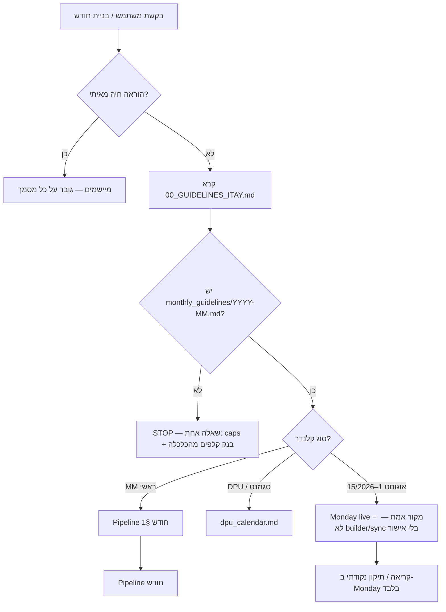
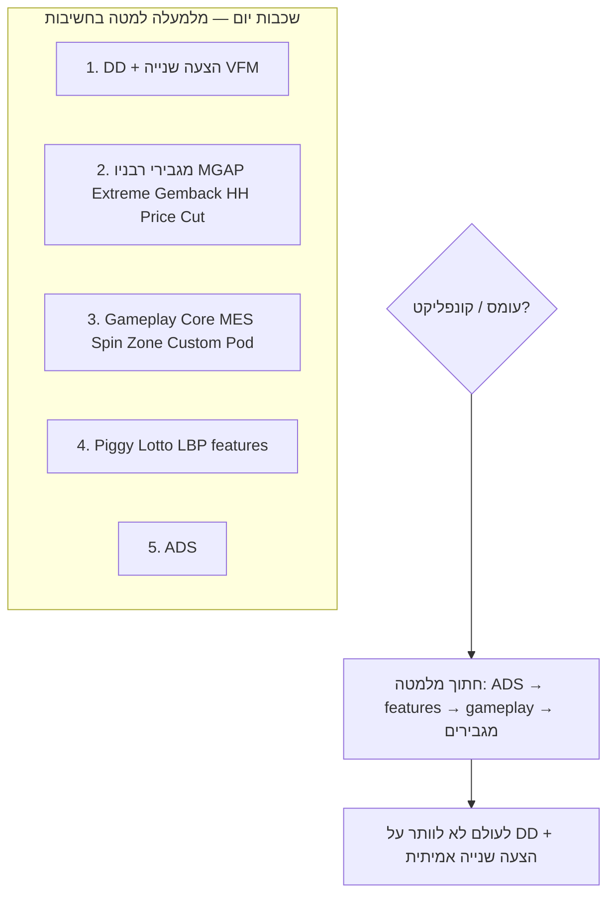
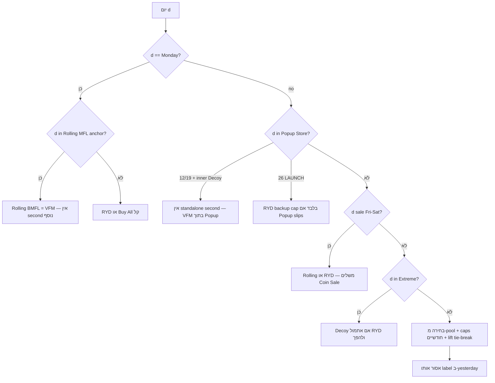
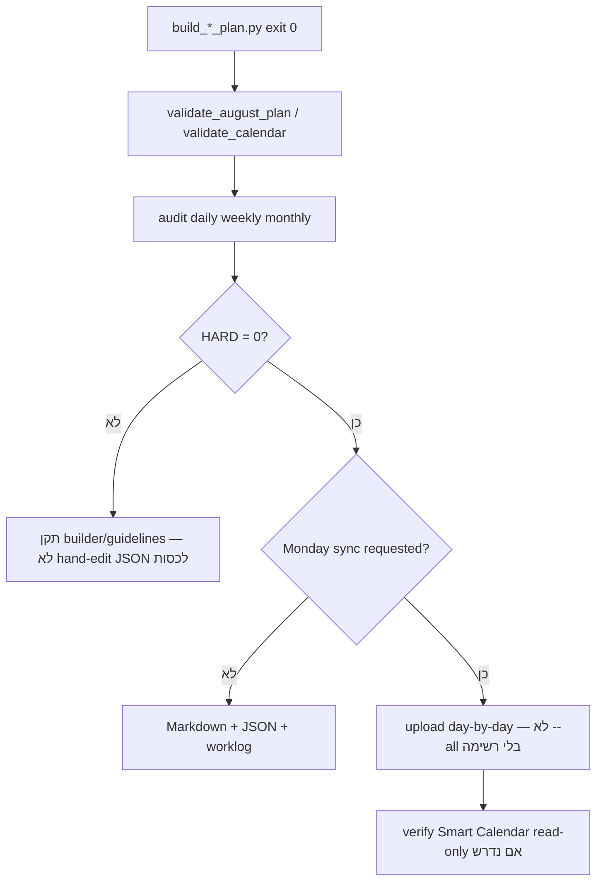

# עץ פעולות / החלטות — שיבוץ חודש MM Calendar

**קהל:** Itay, המחלקה, סוכני Cursor  
**מקורות:** `BUILD_CALENDAR_ROUTER.md`, `PRIZE_PRIORITY_AND_MONTH_BUILD.md`, `mm_calendar_builder.mdc`, `build_august_2026_plan.py`  
**עודכן:** יולי 2026

---

## 0. כניסה — מה קורה לפני שמתחילים?



| שאלה | החלטה |
|------|--------|
| מי מנצח בסתירה? | **Itay חי** → `00_GUIDELINES_ITAY` → **guidelines חודש** (caps + בנק קלפים HARD) → `constraints` / cheatsheet → learnings → performance |
| אפשר להמציא מספר/כלל? | **לא** — חסר = שאלה / `MISSING_DATA_REGISTER`, לא ניחוש |
| לעדכן Monday? | **רק** אם המשתמש ביקש במפורש (`upload_mm_calendar_day_monday.py`) |

---

## 1. Pipeline חודש — סדר מחייב

```mermaid
flowchart LR
  subgraph prep [הכנה]
    M1[monthly_guidelines]
    M2[עונות + שלב Album]
  end
  subgraph anchors [עוגנים]
    A1[always-on ST/MT/Album]
    A2[recurring_events + אירועים]
  end
  subgraph money [מוניטיזציה]
    D1[DD + ledger קלפים]
    D2[הצעה שנייה VFM + תמחור]
    D3[MGAP / Gems / מגבירים]
  end
  subgraph sinks [ניקוז]
    S1[Core coin sink]
    S2[Shiny / Winovate gem sink]
    S3[Clan-Dash]
  end
  subgraph tail [סיום]
    T1[ADS]
    T2[validate + audit]
    T3[Markdown + JSON]
  end
  M1 --> M2 --> A1 --> A2 --> D1 --> D2 --> D3 --> S1 --> S2 --> S3 --> T1 --> T2 --> T3
```



| שלב | פעולה | קבצים |
|-----|--------|--------|
| 1 | תקרות חודש + **בנק קלפים לפי שבוע** (HARD) | `monthly_guidelines/`, `topics/07_seasons_album_cards/` |
| 2 | Short Term 5d, Mid (Quest/Globez/Figz + Winovate + Mega Pods), Album phase | `lanes.md`, `recurring_events.md` |
| 3 | עוגנים: שני Dash, חמישי Golden Spin, רביעי Piggy, Lotto peak, MGAP 2/שבוע, Sale שישי–שבת, Price Cut×2, BMFL/Rolling cooldown | `topics/08_anchors_timing/` |
| 4 | **לכל יום:** DD (+ once Wild/Shiny → חובה DD multiple) | `topics/02_daily_deal/`, `offer_construction.md` |
| 5 | הצעה שנייה אמיתית (לא Clan-Dash): RYD / Buy All / Decoy / Rolling / PM — **ללא אותו משפחה ביומיים רצופים** | `topics/04_second_offers/` |
| 6 | MGAP, Extreme, Gemback, GGS, Price Cut — **VFM קוינס: עד אחד heavy/day** (חריג: אירוע ענק) | `topics/05_mgap_gems_amplifiers/` |
| 7 | Core ≥1 (שני: Dash Pass מספיק), Shiny ~3/שבוע, Clan template | `topics/06`, `topics/11` |
| 8 | ADS — פרס נמוך, אחרון | `constraints.md` |
| 9 | `build_*_plan.py` exit 0 + `audit_*` | builder + `constraints.md` |
| 10 | Monday / dashboard | **רק אחרי אישור** (אוגוסט 1–15: Monday קודם) |

**קידוד אוגוסט 2026:** `scripts/build_august_2026_plan.py` → `data/august_2026_plan.json`.

---

## 2. בניית יום — עדיפות ומה לחתוך



| כלל | החלטה |
|-----|--------|
| צפифות Monday (HARD) | ≤1 Core משחקי, ≤1 Shiny (לא בשני), DD בשורה אחת, 5–9 פריטים ממוקדים |
| שני (Dash Day) | DD + second קל (RYD/Buy All); **אין** MGAP/Coin Sale/PM כבד; Rolling רק BMFL anchor |
| DD + second pricing | **שני tiers שונים** באותו יום (אם שניהם מתומחרים) |
| Popup Store | רק **12 / 19 / 26**; 12/19 VFM ב-inner offer; **26 LAUNCH shell** + RYD = **BACKUP cap** בלבד |

---

## 3. עץ החלטות — קלף / פרס

```
האם הפרס ביום רכישה (DD on-purchase, RYD, Buy All, Decoy, PM, Counter PO)?
├─ לא → Gold אסור ב-Core/MES/ADS gameplay
├─ כן → Gold מותר; Wild ≤1 per offer source
│
האם סוג הקלף בבנק השבוע (monthly_guidelines)?
├─ לא → STOP — לא להמציא; שאל / חריג מאיתי
└─ כן → המשך
    │
    יום premium (sale / BTS / Counter PO / Decoy d3)?
    ├─ כן → Wild / Shiny Limited / 5★ / top bank
    └─ לא → Reg/Ace/Gold לפי bank + season SKU
        │
        ADS?
        └─ כן → Coins/Gems/low Reg בלבד — לא Wild/Gold/Shiny/Ace גבוה
```

**ערך (August economy):** Wild Gold/Ord/Shiny Ltd > Shiny Card > 5★ > 4★ > 3★  
**SKU עונה קצרה:** Blast→Superboom/PAB · Battlesheep→Parasheep/Airstrike · SNL→Dice×2/3/Multiwheel/Shield  
**Extreme Stamp day:** RDS→Extreme; 4 RDS → 2 Extreme; **אין Wild** באותן הצעות  
**Hammers:** **מוצר אחד ביום** נותן Hammers (Rolling spread בתוך המוצר)

---

## 4. עץ החלטות — הצעה שנייה (VFM)



| מצב | החלטה |
|-----|--------|
| Rolling MFL (3/16/25 אוגוסט) | BMFL High, 3 cycles — **ה-VFM של היום** |
| Popup 12/19 | Decoy (או inner) — **לא** Decoy Bonanza נפרד + Popup |
| Popup 26 | Shell LAUNCH; RYD בשם **BACKUP cap** — לא VFM מקביל |
| BTS / event 22 | ללא second מלא — event stack |
| Counter PO day | RYD forced (לא PM למחר) |

---

## 5. MGAP / מגבירים — gates

```
שבוע w כבר יש 2 MGAP?
├─ כן → לא MGAP נוסף (HARD)
└─ לא → בחר variant (BOGO / Bigger / Matched) לפי rotation + learnings
    │
    יום שני? → אסור MGAP
    יום sale? → BOGO אסור על sale (אוגוסט builder)
    MGAP + Bucks? → אסור (חלש)
    │
    VFM heavy כבר היום (Coin Sale / Price Cut / Extreme / Matched / BMFL)?
    └─ אל תערום שני heavy coin VFM (Soft/HARD לפי constraints)
```

**GGS:** ≤2/שבוע, 3h post 11:00 UTC, לא consecutive days, לא עם Gems Sale (learnings).

---

## 6. ולידציה — gates לפני “סיימנו”



**דגשים audit:** VFM כל יום (Popup shell = VFM ב-26), DD once+multiple, Popup רק 12/19/26, Rolling stamps ≤4 RDS / ≤2 GGS per cycle.

---

## 7. Router משימה → תיעוד (קצר)

| אתה עושה | קרא |
|----------|-----|
| DD | `topics/02_daily_deal/README.md` |
| Rolling / BMFL | `topics/03_rolling_offer/`, `rolling_offer.md` |
| RYD / Decoy / Buy All | `topics/04_second_offers/` |
| MGAP / Gems | `topics/05_mgap_gems_amplifiers/` |
| Core / MES | `topics/06_core_coin_sink/` |
| בנק קלפים | `topics/07_seasons_album_cards/` + שורת שבוע ב-guidelines |
| Monday columns | `topics/09_monday_board/`, `board_schema.md` |
| ביצועים / baseline | `measurement/`, `performance/` |

**נקודת כניסה תמיד:** `BUILD_CALENDAR_ROUTER.md`

---

## 8. פלט ו-Git

| פלט | נתיב |
|-----|------|
| JSON תוכנית | `mm_calendar/data/*_plan.json` |
| קלנדר אנושי | `mm_calendar/examples/YYYY-MM_calendar.md` |
| Dashboard | `build_calendar_html.py` |
| שינוי `.cursor/rules/` | **commit + push** (`git_sync_rules.mdc`) |
| ידע למחלקה | https://github.com/ppuregoldz-arch/slotomania-mm-calendar |

---

## 9. תזכורת אוגוסט 2026 (מצב נוכחי)

| נושא | החלטה שסוכמה |
|------|----------------|
| Popup Store | **12 / 19 / 26** (TEST→TEST→LAUNCH) |
| Rolling MGAP ladder | **11/8** — 4 cycles BXGY, MGAP configs 2–4 |
| 12/8 | Popup + Rolling 6 — **ללא** Decoy Bonanza |
| 26/8 | Popup LAUNCH; RYD = **BACKUP cap** בכותרת |
| 1–15/8 | **Monday** = authority; builder לא דורס בלי אישור Itay |

---

*מסמך זה מסכם את **תהליך ההחלטות** — לא מחליף `monthly_guidelines` או `constraints.md`.*
